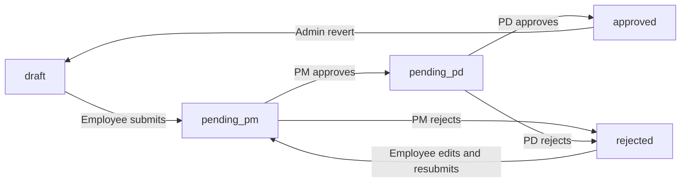

# Timesheet Application Workflow

End-to-end guide for how projects, weekly hours, timesheets, and approvals work in this app.

---

## Roles

| Role | Main responsibility |
|------|---------------------|
| **Employee** | Log hours, submit timesheets, view assigned projects |
| **Project Manager (PM)** | Approve or reject timesheets for projects they manage |
| **Project Director (PD)** | Final approve or reject (when enabled in settings) |
| **Admin** | Full access — edit anyone's drafts, revert approved timesheets |

---

## 1. Project setup (PM / Admin)

Projects are created under **Management → Projects**.

Each project includes:

- Timeline (start and end dates)
- Assigned **PM** and **PD**
- **Members** and their roles on the project
- Status: `active` or `archived`

Employees only see projects they are assigned to. PMs and PDs see projects they manage or direct.

---

## 2. Logging hours — Weekly hours page

**Time Tracking → Weekly hours** is the main data-entry screen.

### Layout

One **row per project per week** (Monday–Sunday):

| Project | Activity | Mon | Tue | Wed | Thu | Fri | Sat | Sun | Duration |
|---------|----------|-----|-----|-----|-----|-----|-----|-----|----------|

### Actions

- **Save** — stores draft timesheets in the database
- **+ Add** — adds another project row for the same week
- **Print / Download PDF** — export the current week (header actions)

### Validation rules

- One project per user per week (no duplicate project rows)
- Only **draft** and **rejected** rows are editable
- Submitted or approved rows appear read-only on the grid
- Activity is optional when saving a draft — required when submitting for approval

### Field mapping

| UI column | Database field | Meaning |
|-----------|----------------|---------|
| Activity | `tasks` | What you worked on that week (e.g. site visit, db housekeeping) |
| Project role | `project_role` | Your role on the project (e.g. Developer) — edited on the full timesheet form |

### Who can edit

| Role | Access |
|------|--------|
| Employee | Own weekly sheet only |
| Admin | Any employee's sheet |
| PM / PD | View only (no edit on this page) |

---

## 3. Detailed timesheet record

**Time Tracking → Timesheets** shows the full timesheet record for a user/project/week.

This uses the **same underlying data** as Weekly hours, but adds:

- Daily **tasks / notes** per day
- **Submit**, **Approve**, **Reject**, and **Revert to draft** actions
- Approval history

Submit for approval happens here, not on the Weekly hours page.

---

## 4. Submission

When an employee clicks **Submit** on a timesheet:

1. Validates project, activity, week start (must be Monday), and hours
2. Status changes: `draft` → `pending_pm`
3. An approval log entry is recorded (`submitted`)
4. Email notification is sent to the PM (if email notifications are enabled)

After submission, the employee **cannot edit** the timesheet until it is rejected or an admin reverts it to draft.

---

## 5. Approval workflow

### Status diagram



### PM step (`pending_pm`)

The project's assigned PM can **Approve** or **Reject**.

- **Approve** → `pending_pd` if director approval is required, otherwise `approved`
- **Reject** → `rejected`

Director approval is controlled by **Administration → Settings → Require director approval** (default: on).

### PD step (`pending_pd`)

When director approval is enabled, the project's assigned PD gives final **Approve** or **Reject**.

- **Approve** → `approved`
- **Reject** → `rejected`

### Rejection

- Status becomes `rejected`
- Employee receives an email notification (if enabled)
- Employee can edit the timesheet again and resubmit

---

## 6. After approval

- Timesheet is locked (read-only for employees)
- Hours appear in **Reports** (group by project, week, month, or member)
- Individual timesheet PDF and summary PDF export are available
- **Admin only**: can **Revert to draft** from `approved`, with a required reason

---

## 7. Other areas

| Area | Who | Purpose |
|------|-----|---------|
| **My Projects** | Employees | Assigned projects, hours logged, schedule health |
| **Reports** | PM / PD / Admin | Aggregated hours; CSV export |
| **Settings** | Admin | Director approval toggle, email notifications, standard weekly hours |
| **Audit Log** | Admin | Record of admin and workflow actions |

---

## 8. Typical employee week

1. Open **Weekly hours** and select the week
2. Add a row for each project worked on; enter hours per day
3. Click **Save** (draft — can return later)
4. Open **Timesheets**, review the record, fill in activity and daily tasks if needed
5. Click **Submit** for PM approval
6. If **rejected** → fix on Weekly hours → submit again
7. If **approved** → done for that week/project

---

## 9. Data model

Each timesheet row represents:

```
one user + one project + one week (Monday start)
```

Database constraint: `timesheets_user_id_project_id_week_start_unique`

That is why:

- Duplicate project rows for the same week are blocked
- Weekly hours and Timesheets share the same records
- Saving on Weekly hours updates the same row that appears in Timesheets

### Timesheet fields (key)

| Field | Description |
|-------|-------------|
| `user_id` | Employee who logged the hours |
| `project_id` | Project the hours belong to |
| `project_role` | Your role on the project (e.g. Developer, QC Engineer) |
| `week_start` | Monday of the week (date) |
| `hours` | JSON array of 7 daily hour values |
| `tasks` | JSON array of 7 daily activity/task strings (shown as Activity on Weekly hours) |
| `status` | Workflow status (see diagram above) |
| `notes` | Optional overall notes |

### Status values

| Status | Editable by employee | Meaning |
|--------|----------------------|---------|
| `draft` | Yes | Work in progress |
| `pending_pm` | No | Awaiting PM approval |
| `pending_pd` | No | Awaiting PD approval |
| `approved` | No | Finalised |
| `rejected` | Yes | Sent back for correction |

---

## 10. Notifications

When email notifications are enabled (**Settings → Email notifications**):

| Event | Recipient |
|-------|-----------|
| Timesheet submitted | Project PM |
| PM approved, pending PD | Project PD |
| Timesheet approved | Employee |
| Timesheet rejected | Employee |

---

## 11. Export routes

| Route | Purpose |
|-------|---------|
| `GET /weekly-hours/print/{user}/{weekStart}` | Print-friendly weekly hours view |
| `GET /pdf/weekly-hours/{user}/{weekStart}` | Weekly hours PDF |
| `GET /pdf/timesheet/{timesheet}` | Single timesheet PDF |
| `GET /pdf/summary` | Summary PDF (query parameters) |

All export routes require authentication and respect role-based access.
